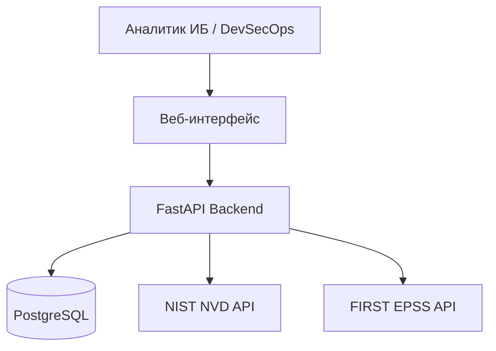
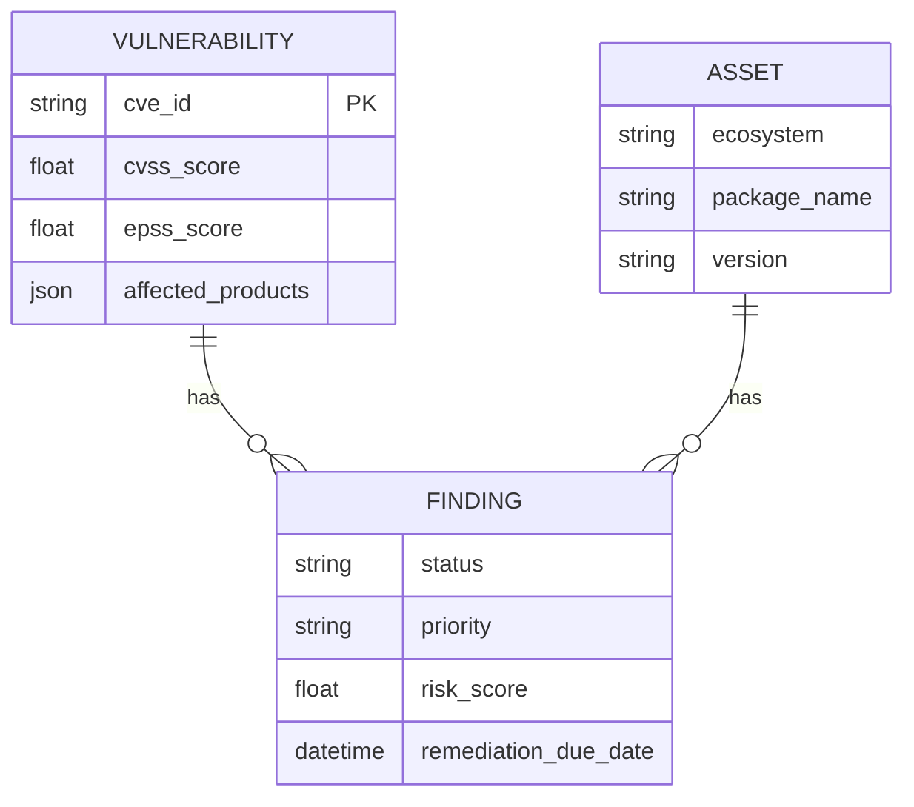
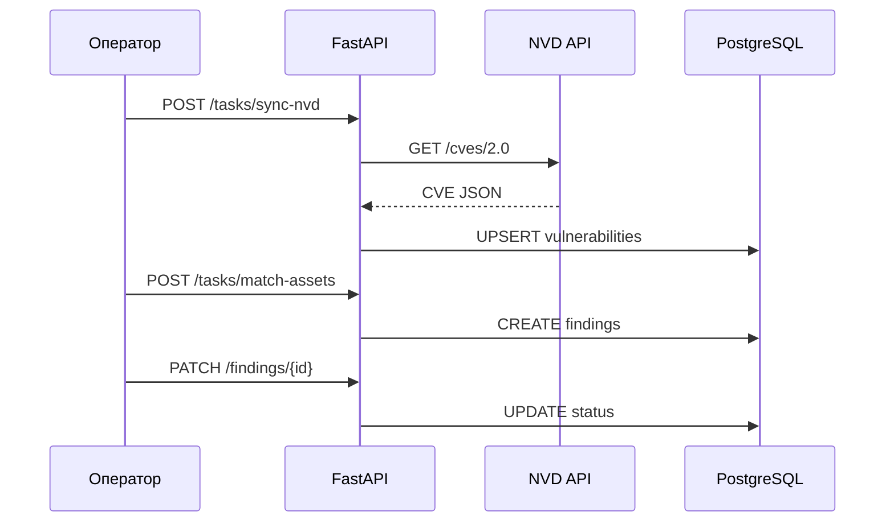

# Архитектура — Платформа управления уязвимостями (вариант 4)

## Контекст (C4 — уровень системы)

## Компоненты

| Модуль | Назначение |
|--------|------------|
| `NVDCollector` | Сбор CVE из NVD API 2.0 |
| `EPSSCollector` | Обновление вероятности эксплуатации |
| `VulnerabilityMatcher` | Сопоставление CVE ↔ инвентарь ПО |
| `prioritizer` | CVSS × EPSS × критичность актива, SLA |
| REST API | CRUD, отчёты, фоновые задачи |
| Static UI | Дашборд, находки, синхронизация |

## ER-диаграмма

## Поток данных

## Технологический стек (по методичке)

- **Python 3.12** + **FastAPI** + **Pydantic V2**
- **PostgreSQL** + **SQLAlchemy 2**
- **NVD API** — открытый источник CVE
- **Docker / Docker Compose**
- **pytest**, **Bandit**, **pip-audit**, **GitHub Actions**
